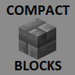

<!-- PROJECT SHIELDS -->
<!--
*** I'm using markdown "reference style" links for readability.
*** Reference links are enclosed in brackets [ ] instead of parentheses ( ).
*** See the bottom of this document for the declaration of the reference variables
*** for contributors-url, forks-url, etc. This is an optional, concise syntax you may use.
*** https://www.markdownguide.org/basic-syntax/#reference-style-links
-->
[![Contributors][contributors-shield]][contributors-url]
[![Forks][forks-shield]][forks-url]
[![Stargazers][stars-shield]][stars-url]
[![Issues][issues-shield]][issues-url]
[![MIT License][license-shield]][license-url]


<!-- PROJECT LOGO -->
<br />
<p align="center">
  <a href="https://github.com/othneildrew/Best-README-Template">
    
  </a>

  <h3 align="center">Compact Blocks</h3>

  <p align="center">
    Compact blocks is a Spigot plugin that adds recipes to craft compacted variants of most blocks in Minecraft.
    <br />
    <br />
    <a href="https://github.com/karlmartitoots/CompactBlocks/issues">Report Bug</a>
    ·
    <a href="https://github.com/karlmartitoots/CompactBlocks/issues">Request Feature</a>
  </p>
</p>


<!-- TABLE OF CONTENTS -->
<details open="open">
  <summary>Table of Contents</summary>
  <ol>
    <li><a href="#about-the-project">Features</a></li>
    <li><a href="#installation">Installation</a></li>
    <li><a href="#contributing">Contributing</a></li>
    <li><a href="#license">License</a></li>
    <li><a href="#acknowledgements">Acknowledgements</a></li>
  </ol>
</details>


<!-- ABOUT THE PROJECT -->
## Features

![Example Crafting Recipe][product-screenshot]

Use 9 blocks in a crafting bench to create the compact block.

Right click with the compact block in hand to uncompact one block.

Shift + right click to uncompact all blocks in hand.

## Installation

1. Download the [plugin jar](https://github.com/karlmartitoots/CompactBlocks/releases) for your minecraft version
2. Place the jar into your Spigot server plugins folder
3. Restart the server

## Configuration

Any compact block skin can be configured via the config.yml file generated by the plugin.

The config.yml file contains a list of block materials and Minecraft skull texture base64 values in format:
```sh
[Material]: [textureBase64]
```
See [Minecraft Heads](https://minecraft-heads.com/) for custom skull textures. You can even create your own!

If you wish to add or change a compact block, see the [Spigot documentation](https://hub.spigotmc.org/javadocs/bukkit/org/bukkit/Material.html) for a list of possible blocks to add to the configuration.

<!-- CONTRIBUTING -->
## Contributing

Contributions are what make the open source community such an amazing place to learn, inspire, and create. Any contributions you make are **greatly appreciated**.

1. Fork the Project
2. Create your Feature Branch (`git checkout -b feature/AmazingFeature`)
3. Commit your Changes (`git commit -m 'Add some AmazingFeature'`)
4. Push to the Branch (`git push origin feature/AmazingFeature`)
5. Open a Pull Request

<!-- LICENSE -->
## License

Distributed under the MIT License. See `LICENSE` for more information.

<!-- ACKNOWLEDGEMENTS -->
## Acknowledgements
* [Minecraft Heads](https://minecraft-heads.com/)
* [SkullCreator](https://github.com/deanveloper/SkullCreator)
* [Spigot](https://hub.spigotmc.org/)


<!-- MARKDOWN LINKS & IMAGES -->
<!-- https://www.markdownguide.org/basic-syntax/#reference-style-links -->
[contributors-shield]: https://img.shields.io/github/contributors/othneildrew/Best-README-Template.svg?style=for-the-badge
[contributors-url]: https://github.com/karlmartitoots/CompactBlocks/graphs/contributors
[forks-shield]: https://img.shields.io/github/forks/karlmartitoots/CompactBlocks?style=for-the-badge
[forks-url]: https://github.com/karlmartitoots/CompactBlocks/network/members
[stars-shield]: https://img.shields.io/github/stars/karlmartitoots/CompactBlocks?style=for-the-badge
[stars-url]: https://github.com/othneildrew/CompactBlocks/stargazers
[issues-shield]: https://img.shields.io/github/issues/karlmartitoots/CompactBlocks?style=for-the-badge
[issues-url]: https://github.com/karlmartitoots/CompactBlocks/issues
[license-shield]: https://img.shields.io/github/license/karlmartitoots/CompactBlocks?style=for-the-badge
[license-url]: https://github.com/karlmartitoots/CompactBlocks/blob/main/LICENSE
[product-screenshot]: images/compacts_demo_1.PNG
